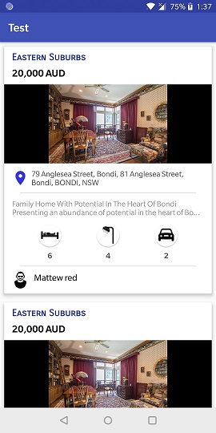
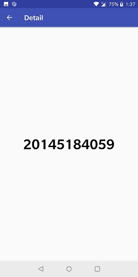
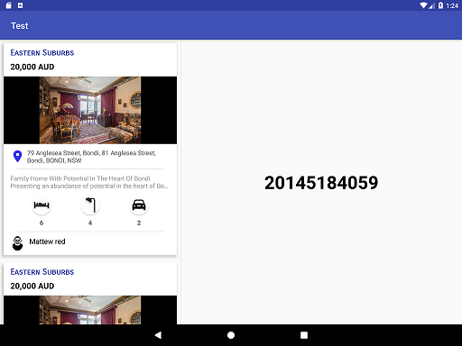

# AndroidTest
An Android app showcasing a list of properties in Master-Detail layout. This app has been written in Kotlin, with a couple of classes in Java.

## Screenshots

      

## Technical Specifications

* Most of the code is written in Kotlin. The only classes written in Java are MainActivity and DetailActivity.
* MVVM architecture is followed. ViewModel and LiveData architecture components are used.
* Data Binding has been incorporated.
* The app retains its state during orientation changes.

### Master - Detail Flow
* Master - This layout contains a list view of properties. Properties are of two types - Standard and Premium. Premium properties are differentiated by a Star icon.
* Detail - This layout displays the Id of the selected Item.

## Libraries Used

* Retrofit & Gson - Networking calls
* Glide - Image loading
* hdodenhof CircleImageView - Circular Image View for Avatar
